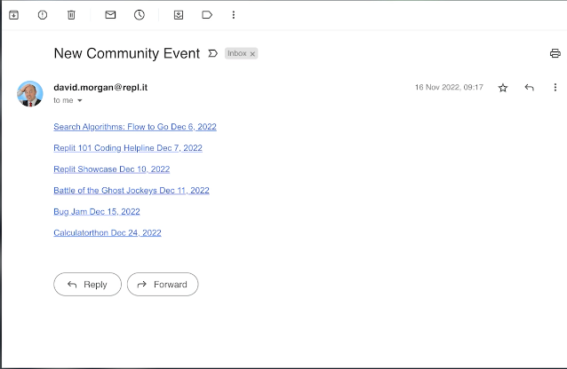

# 👉 Day 99 Challenge

Today's challenge is to create a combo scraper: emailer and scheduler.

Your program should:

1. Scrape the [Replit Community Hub](https://replit.com/community-hub) for events and put them into a list.
2. Filter the events by topics that interest you (remember how we filtered news articles from hacker news?)
3. Schedule the scrape for every 6 hours.
4. If an event of interest is scraped, email yourself (or a friend) with a hyperlink to the event.
5. Only email any **new** events.

Example:

 
 💡 Hints 

  
- Use Replit db to store the events
- Use a list to store the key search terms for topics of interest.

